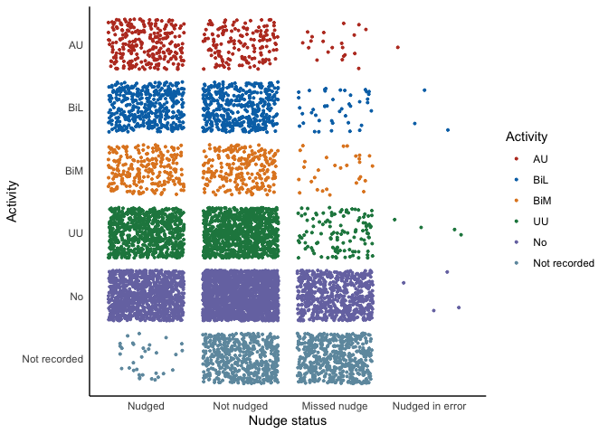
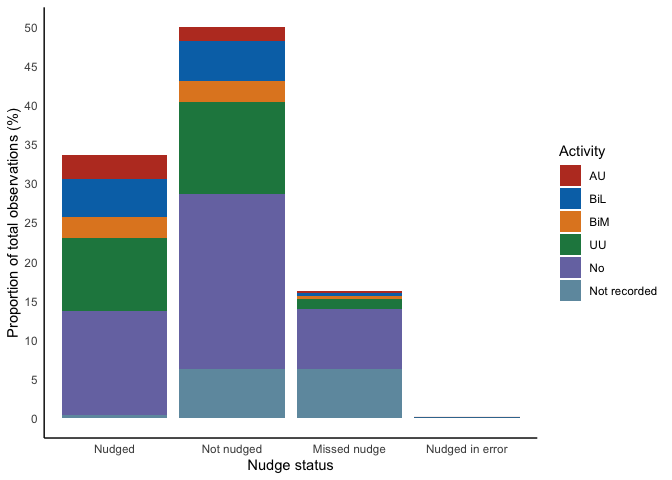
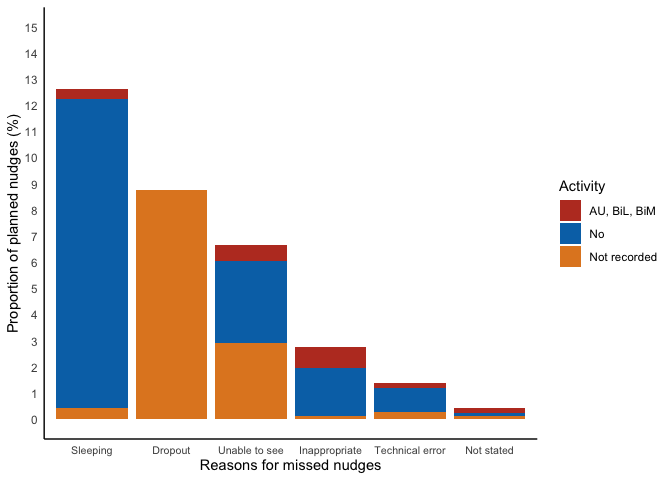
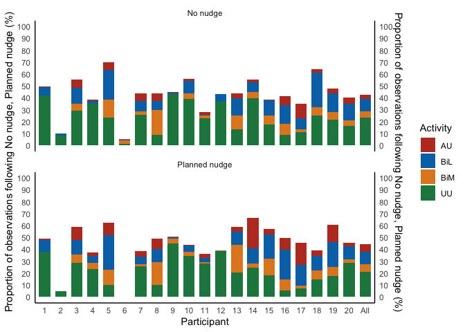
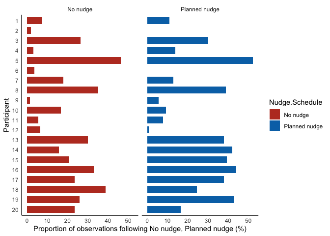
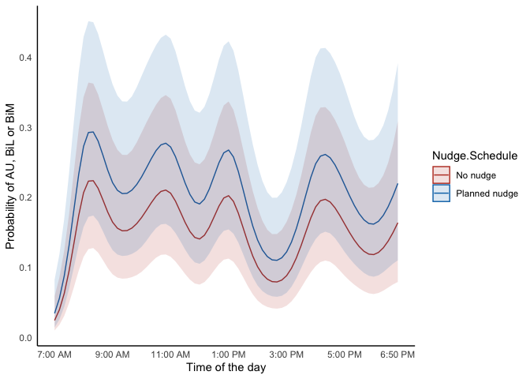
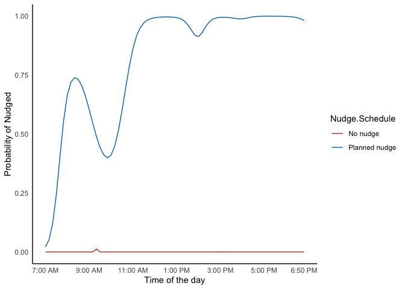

-   <a href="#randomisation-schedule"
    id="toc-randomisation-schedule">Randomisation Schedule</a>
-   <a href="#variables-included-in-the-analysis"
    id="toc-variables-included-in-the-analysis">Variables Included in the
    Analysis</a>
-   <a href="#data-visualisations" id="toc-data-visualisations">Data
    Visualisations</a>
    -   <a href="#activity-distribution" id="toc-activity-distribution">Activity
        Distribution</a>
    -   <a href="#activity-proportions" id="toc-activity-proportions">Activity
        Proportions</a>
    -   <a href="#reasons-for-missed-nudges"
        id="toc-reasons-for-missed-nudges">Reasons for Missed Nudges</a>
    -   <a href="#participant-wise-activity-proportions"
        id="toc-participant-wise-activity-proportions">Participant-wise Activity
        Proportions</a>
    -   <a href="#participant-wise-proportions-for-au-bil-bim"
        id="toc-participant-wise-proportions-for-au-bil-bim">Participant-wise
        Proportions for AU, BiL, BiM</a>
-   <a href="#primary-analysis" id="toc-primary-analysis">Primary
    Analysis</a>
    -   <a href="#logistic-mixed-model" id="toc-logistic-mixed-model">Logistic
        Mixed Model</a>
    -   <a href="#model-estimates-with-confidence-intervals"
        id="toc-model-estimates-with-confidence-intervals">Model Estimates with
        Confidence Intervals</a>
    -   <a href="#variance-explained-across-time-with-natural-splines"
        id="toc-variance-explained-across-time-with-natural-splines">Variance
        Explained across Time with Natural Splines</a>
    -   <a href="#sensitivity-analysis"
        id="toc-sensitivity-analysis">Sensitivity Analysis</a>
        -   <a href="#logistic-mixed-models" id="toc-logistic-mixed-models">Logistic
            Mixed Models</a>
        -   <a href="#sensitivity-estimates-with-confidence-intervals"
            id="toc-sensitivity-estimates-with-confidence-intervals">Sensitivity
            Estimates with Confidence Intervals</a>
    -   <a href="#exploratory-analysis"
        id="toc-exploratory-analysis">Exploratory Analysis</a>
        -   <a href="#local-average-treatment-effect-late"
            id="toc-local-average-treatment-effect-late">Local Average Treatment
            Effect (LATE)</a>
        -   <a href="#logistic-mixed-models-1"
            id="toc-logistic-mixed-models-1">Logistic Mixed Models</a>
        -   <a href="#late-estimate-with-confidence-intervals"
            id="toc-late-estimate-with-confidence-intervals">LATE Estimate with
            Confidence Intervals</a>
        -   <a href="#estimated-compliance-across-time"
            id="toc-estimated-compliance-across-time">Estimated Compliance across
            Time</a>
-   <a href="#secondary-analysis" id="toc-secondary-analysis">Secondary
    Analysis</a>
    -   <a href="#logistic-mixed-models-2"
        id="toc-logistic-mixed-models-2">Logistic Mixed Models</a>
    -   <a href="#model-estimates-with-confidence-intervals-1"
        id="toc-model-estimates-with-confidence-intervals-1">Model Estimates
        with Confidence Intervals</a>

# Randomisation Schedule

Haptic nudge reminders were manually triggered by the observer
immediately prior to movement observation by the researcher according to
a planned randomisation schedule, such that for half of the observation
periods a haptic nudge was to be provided and for half a haptic nudge
was not to be provided. To account for any potential carry over effect
across multiple observation periods randomisation was designed to
deliver different types of nudge sequences. These sequences are given in
the following table along with their number of occurrences.

| Nudge sequence                                | No. of occurrences |
|:----------------------------------------------|:-------------------|
| Nudge, No nudge                               | 120, 120           |
| Nudge-Nudge, No nudge-No nudge                | 120, 120           |
| Nudge-Nudge-Nudge, No nudge-No nudge-No nudge | 120, 120           |
| Total                                         | 720, 720           |

# Variables Included in the Analysis

    ## 'data.frame':    8640 obs. of  7 variables:
    ##  $ PartID      : Factor w/ 20 levels "1","2","3","4",..: 1 1 1 1 1 1 1 1 1 1 ...
    ##  $ Time        : Factor w/ 72 levels "1:00 PM","1:10 PM",..: 55 56 57 58 59 60 61 62 63 64 ...
    ##  $ Obs         : num  1 2 3 4 5 6 7 8 9 10 ...
    ##  $ Activity    : Factor w/ 6 levels "AU","BiL","BiM",..: 6 5 4 6 5 5 4 4 4 4 ...
    ##  $ Hour        : Factor w/ 12 levels "1","2","3","4",..: 1 1 1 1 1 1 2 2 2 2 ...
    ##  $ Reason.DNN  : Factor w/ 7 levels "Inappropriate",..: 3 7 7 3 7 7 7 7 7 7 ...
    ##  $ Nudge.Status: Factor w/ 4 levels "Nudged","Not nudged",..: 3 2 1 3 1 2 2 2 1 1 ...

# Data Visualisations

## Activity Distribution

<!-- -->

## Activity Proportions

Each planned category (Nudge, No nudge) was to precede half (or 50%) of
the total observations. However, it was not always possible to nudge the
participants in accordance with the schedule. This resulted in an
additional category (Missed nudge). Moreover, in some cases participants
were nudged mistakenly when they were not supposed to be nudged. This
also resulted in an additional category (Nudged in error).

<!-- -->

## Reasons for Missed Nudges

<!-- -->

## Participant-wise Activity Proportions

In this and subsequent sections, Nudged and Missed nudge are treated as
a single category (Planned nudge), and Not nudged and Nudged in error
are both treated as No nudge.

<!-- -->

## Participant-wise Proportions for AU, BiL, BiM

<!-- -->

# Primary Analysis

The aim of this intention to treat analysis is to estimate the effect of
Planned nudge compared to No nudge on the combined proportion of AU, BiL
or BiM types of activity out of AU, BiL, BiM, UU and No.

``` r
modelData                 <- dataSource.orig

modelData$Nudge.Schedule  <- factor(modelData$Nudge.Status,
                                    levels = c("Nudged", "Not nudged",
                                               "Missed nudge", "Nudged in error"),
                                    labels = c("Planned nudge", "No nudge",
                                               "Planned nudge", "No nudge"))

modelData$Activity        <- factor(modelData$Activity,
                                    levels = c("AU", "BiL", "BiM", "UU",
                                               "No", "Not recorded"),
                                    labels = c("AU, BiL, BiM", "AU, BiL, BiM",
                                               "AU, BiL, BiM",
                                               "No", "No", "Not recorded"))

levels(modelData$Activity)[levels(modelData$Activity) == "Not recorded"] <- NA

modelData$Activity        <- relevel(modelData$Activity, "No")
```

## Logistic Mixed Model

The model has smooth cubic splines to explain variance across time. The
knots are placed at: \[8:00 AM, 9:00 AM, 10:00 AM, 11:00 AM, 12:00 PM,
1:00 PM, 2:00 PM, 3:00 PM, 4:00 PM, 5:00 PM, 6:00 PM\].

``` r
lmerModel <- glmer(Activity ~ Nudge.Schedule + ns(Obs, knots = seq(7, 67, 6)) +
                     (1|PartID/Hour),
                   na.action = na.omit,
                   data = modelData,
                   family = binomial(link = "logit"),
                   control = glmerControl(optimizer = "bobyqa"))
```

## Model Estimates with Confidence Intervals

| Buzzed        | Probability |        SE | 95% CI lower | 95% CI upper |
|:--------------|------------:|----------:|-------------:|-------------:|
| Planned nudge |   0.2670266 | 0.0694465 |    0.1537880 |    0.4220589 |
| No nudge      |   0.2017954 | 0.0570741 |    0.1120875 |    0.3361211 |

| Contrast                 | Odds ratio |        SE |  Z-value | P-value | 95% CI lower | 95% CI upper |
|:-------------------------|-----------:|----------:|---------:|--------:|-------------:|-------------:|
| Planned nudge / No nudge |   1.441018 | 0.0898571 | 5.859032 |       0 |     1.275238 |     1.628349 |

## Variance Explained across Time with Natural Splines

<!-- -->

## Sensitivity Analysis

A sensitivity analysis consisting of a simulated worst-case scenario is
conducted to evaluate the sensitivity of the estimated effect size for
the Planned nudge to missing data. The worst-case simulation is based on
multiple (m = 10) random imputations from single trial binomial
distributions with mean activity proportions of the participant with
worst outcomes.

``` r
modelData.WC              <- dataSource.orig

modelData.WC$
  Nudge.Schedule          <- factor(modelData.WC$Nudge.Status,
                                    levels = c("Nudged", "Not nudged",
                                               "Missed nudge", "Nudged in error"),
                                    labels = c("Planned nudge", "No nudge",
                                               "Planned nudge", "No nudge"))

modelData.WC$Activity     <- factor(modelData.WC$Activity,
                                    levels = c("AU", "BiL", "BiM", "UU",
                                               "No", "Not recorded"),
                                    labels = c("AU, BiL, BiM", "AU, BiL, BiM",
                                               "AU, BiL, BiM",
                                               "No", "No", "Not recorded"))

levels(modelData.WC$Activity)[levels(modelData.WC$Activity) == "Not recorded"] <- NA

modelData.WC$Activity     <- relevel(modelData.WC$Activity, "No")

list.modelData.WC         <- list()

for(i in seq(1, 10)) { # 10 random imputations
  
  freshCopy               <- modelData.WC
  
  # Random imputation
  # Number of missing values following "No nudge"       = 542
  rNN                     <- factor(rbinom(542, 1, 6.4814815/100),
                                    levels = c(0, 1), labels = c("No", "AU, BiL, BiM"))
  # Number of missing values following "Planned nudge"  = 1122 - 542
  rPN                     <- factor(rbinom(1122 - 542, 1, 0.9259259/100),
                                    levels = c(0, 1), labels = c("No", "AU, BiL, BiM"))
  
  freshCopy$Activity[is.na(freshCopy$Activity) &
                       freshCopy$Nudge.Schedule == "No nudge"]      <- rNN
  freshCopy$Activity[is.na(freshCopy$Activity) &
                       freshCopy$Nudge.Schedule == "Planned nudge"] <- rPN
  
  list.modelData.WC[[i]]  <- freshCopy
}
```

### Logistic Mixed Models

``` r
list.lmerModel.WC <- list()
for(i in seq(1, 10)) {
  list.lmerModel.WC[[i]] <- glmer(Activity ~ Nudge.Schedule +
                                    ns(Obs, knots = seq(7, 67, 6)) +
                                    (1|PartID/Hour),
                                  na.action = na.omit,
                                  data = list.modelData.WC[[i]],
                                  family = binomial(link = "logit"),
                                  control = glmerControl(optimizer = "bobyqa"))
}
```

### Sensitivity Estimates with Confidence Intervals

| Case | Nudge.Schedule | Probability |        SE | 95% CI lower | 95% CI upper |
|:-----|:---------------|------------:|----------:|-------------:|-------------:|
| WC   | Planned nudge  |   0.1991864 | 0.0517262 |    0.1164061 |    0.3195631 |
| WC   | No nudge       |   0.1608939 | 0.0437655 |    0.0922143 |    0.2657749 |

| Case | Contrast                 | Odds ratio |        SE |  Z-value |  P-value | 95% CI lower | 95% CI upper |
|:-----|:-------------------------|-----------:|----------:|---------:|---------:|-------------:|-------------:|
| WC   | Planned nudge / No nudge |   1.297689 | 0.0774633 | 4.362185 | 2.56e-05 |     1.154409 |     1.458753 |

## Exploratory Analysis

### Local Average Treatment Effect (LATE)

To estimate the local average treatment effect (also known as complier
average causal effect (CACE)), an instrumental variable analysis is
conducted.

``` r
modelData.IV                <- dataSource.orig

modelData.IV$
  Nudge.Schedule            <- factor(modelData.IV$Nudge.Status,
                                      levels = c("Nudged", "Not nudged",
                                                 "Missed nudge", "Nudged in error"),
                                      labels = c("Planned nudge", "No nudge",
                                                 "Planned nudge", "No nudge"))

modelData.IV$Nudge.Schedule <- relevel(modelData.IV$Nudge.Schedule, "No nudge")

modelData.IV$Nudge.Deliver  <- factor(modelData.IV$Nudge.Status,
                                      levels = c("Nudged", "Not nudged",
                                                 "Missed nudge", "Nudged in error"),
                                      labels = c("Nudged", "Not nudged",
                                                 "Not nudged", "Nudged"))

modelData.IV$Activity       <- factor(modelData.IV$Activity,
                                      levels = c("AU", "BiL", "BiM", "UU", "No",
                                                 "Not recorded"),
                                      labels = c("AU, BiL, BiM", "AU, BiL, BiM",
                                                 "AU, BiL, BiM",
                                                 "No", "No", "Not recorded"))
modelData.IV$Activity       <- relevel(modelData.IV$Activity, "No")

levels(modelData.IV$Activity)[levels(modelData.IV$Activity) == "Not recorded"] <- NA
```

### Logistic Mixed Models

``` r
lmerModel.IV.r        <- glmer(Nudge.Deliver ~ ns(Obs, knots = seq(7, 67, 6))*Nudge.Schedule +
                                 (1|PartID/Hour),
                               family = binomial(link="logit"),
                               modelData.IV,
                               control = glmerControl(optimizer = "bobyqa",
                                                      optCtrl=list(maxfun = 1e6)))

modelData.IV$
  Nudge.Schedule.r    <- resid(lmerModel.IV.r, type = "response")

lmerModel.IV          <- glmer(Activity ~ Nudge.Deliver + Nudge.Schedule.r +
                                 ns(Obs, knots = seq(7, 67, 6)) +
                                 (1|PartID/Hour),
                               na.action = na.omit,
                               data = modelData.IV,
                               family = binomial(link = "logit"),
                               control = glmerControl(optimizer = "bobyqa"))
```

### LATE Estimate with Confidence Intervals

| Case | Buzzed     | Probability |        SE | 95% CI lower | 95% CI upper |
|:-----|:-----------|------------:|----------:|-------------:|-------------:|
| LATE | Nudged     |   0.2857959 | 0.0724608 |    0.1663566 |    0.4451937 |
| LATE | Not nudged |   0.1965228 | 0.0558364 |    0.1089760 |    0.3284736 |

| Case | Contrast            | Odds ratio |        SE |  Z-value | P-value | 95% CI lower | 95% CI upper |
|:-----|:--------------------|-----------:|----------:|---------:|--------:|-------------:|-------------:|
| LATE | Nudged / Not nudged |   1.636041 | 0.1190303 | 6.766249 |       0 |     1.418616 |     1.886789 |

### Estimated Compliance across Time

<!-- -->

# Secondary Analysis

The aim of this analysis is to separately estimate the effect of Planned
nudge compared to No nudge on the proportion of AU and BiL or BiM types
of activity out of AU, BiL, BiM, UU and No.

## Logistic Mixed Models

Two linear logistic mixed regression models are setup to separately
estimate the effect of Planned nudge compared to No nudge on AU and BiL
or BiM.

``` r
# Model for AU
modelData_AU              <- dataSource.orig

modelData_AU$
  Nudge.Schedule          <- factor(modelData_AU$Nudge.Status,
                                    levels = c("Nudged", "Not nudged",
                                               "Missed nudge", "Nudged in error"),
                                    labels = c("Planned nudge", "No nudge",
                                               "Planned nudge", "No nudge"))

modelData_AU$Activity     <- factor(modelData_AU$Activity,
                             levels = c("AU", "BiL", "BiM", "UU",
                                        "No", "Not recorded"),
                             labels = c("AU", "No", "No",
                                        "No", "No", "Not recorded"))

levels(modelData_AU$Activity)[levels(modelData_AU$Activity) == "Not recorded"] <- NA

modelData_AU$Activity     <- relevel(modelData_AU$Activity, "No")

lmerModel_AU              <- glmer(Activity ~ Nudge.Schedule +
                                     ns(Obs, knots = seq(7, 67, 6)) +
                                     (1|PartID/Hour),
                                   na.action = na.omit,
                                   data = modelData_AU,
                                   family = binomial(link = "logit"),
                                   control = glmerControl(optimizer = "bobyqa"))

# Model for BiL, BiM
modelData_BiL_BiM         <- dataSource.orig

modelData_BiL_BiM$
  Nudge.Schedule          <- factor(modelData_BiL_BiM$Nudge.Status,
                                    levels = c("Nudged", "Not nudged",
                                               "Missed nudge", "Nudged in error"),
                                    labels = c("Planned nudge", "No nudge",
                                               "Planned nudge", "No nudge"))

modelData_BiL_BiM$
  Activity                <- factor(modelData_BiL_BiM$Activity,
                                    levels = c("AU", "BiL", "BiM", "UU",
                                               "No", "Not recorded"),
                                    labels = c("No", "BiL, BiM", "BiL, BiM",
                                               "No", "No", "Not recorded"))

levels(modelData_BiL_BiM$Activity)[levels(modelData_BiL_BiM$Activity) == "Not recorded"] <- NA

modelData_BiL_BiM$
  Activity                <- relevel(modelData_BiL_BiM$Activity, "No")

lmerModel_BiL_BiM         <- glmer(Activity ~ Nudge.Schedule +
                                     ns(Obs, knots = seq(7, 67, 6)) +
                                     (1|PartID/Hour),
                                   na.action = na.omit,
                                   data = modelData_BiL_BiM,
                                   family = binomial(link = "logit"),
                                   control = glmerControl(optimizer = "bobyqa"))
```

## Model Estimates with Confidence Intervals

| Contrast                              | Odds ratio |        SE | Z-value |   P-value |
|:--------------------------------------|-----------:|----------:|--------:|----------:|
| Planned nudge / No nudge (AU)         |   2.034658 | 0.2172070 | 6.65390 | 0.0000000 |
| Planned nudge / No nudge (BiL or BiM) |   1.128862 | 0.0760345 | 1.79957 | 0.0719286 |

| Contrast                              | 95% CI lower | 95% CI upper |
|:--------------------------------------|-------------:|-------------:|
| Planned nudge / No nudge (AU)         |    1.6505268 |     2.508189 |
| Planned nudge / No nudge (BiL or BiM) |    0.9892548 |     1.288171 |
